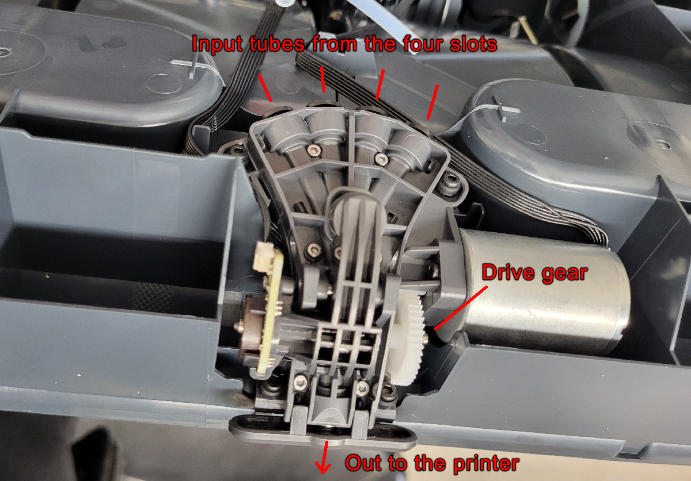

# How to Clear a Clog in the AMS Merger

Today I was having problem with filament not retracting while I was
using Wood PLA and trying to swap two colors in my AMS. I had already
cleared it once and restarted the job. I watched as it retraced the
first color and I could see a little dongle of something getting dragged
back though the tubes, into the AMS, and ... stall. The next color
couldn't feed. The first color couldn't feed. When I pulled it free, the
little dongle was gone, apparently jammed in the unit.

There's lots of advice for dealing with a single tube clog, or one of
the drive gears having problems. Not so much for when it jams the
merger where the tubes from the 4 slots merge together and leave the
AMS to go to the printer. 

This is what worked for me.

- Disconnect the AMS and remove the loaded spools.
- Disconnect the tube from the back that goes out to the printer.
- Unscrew the two screws that hold the base plate down.
- Carefully flip up the baseplate, being sure not to tug on the wires
  connected to back.
- Disconnect each of the 4 tubes leading into the merger from
  the 4 slots.

- Get a piece of clean filament, 15-30cm (6-12 inches) long.
- Try to feed the filament into each of the input tubes.
  - Slide the filament in.
  - Try to turn the drive gear to pull the filament through.
  - If it grabs the filament, good, that one is clear.
    - Reverse the gear to pull it out
  - If you can't push through to the gear, you've found the clog.
  - Pull back and try feeding the neighboring inputs to get the clog
    to dislodge.
- Repeat trying each input. In my case, the little dongle of broken,
  stringy filament that caused the jam eventually worked loose and fed
  back out of the output tube.
- Once all four ports are clear, reconnect the tubes and put the AMS
  back together.

I eventually realized there was a partial clog in my nozzle that was
causing the jamming and stringing. Now that I have that cleared up,
everything seems to be working correctly again.

