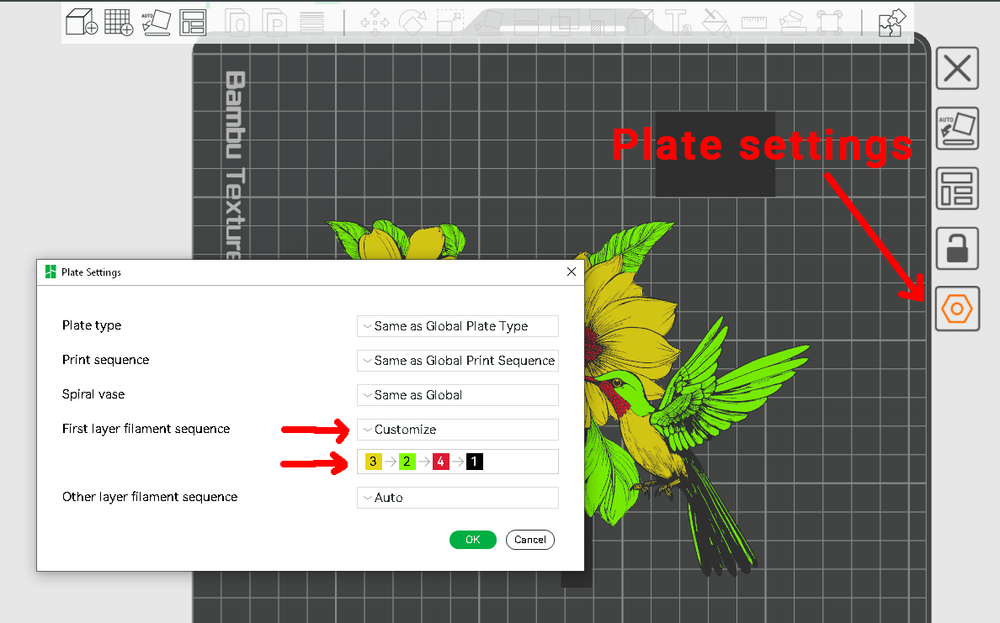

# Set filament color order

This print consists of 4 colors with what should be thin lines of black
around the colored areas. When printed face down, the printer was
defaulting to using black first, which made those lines full width and
blocked out the colors. To solve it, I needed to print the colors first
and black last, at least on the first layer.

In Bambu Studio on the Prepare tab
- click the hexagon icon next to the plate to open Plate Settings
- change First Filament layer sequence to Customize
- drag the colors to select the order that you want
- optional, use the other setting for the other layers.
