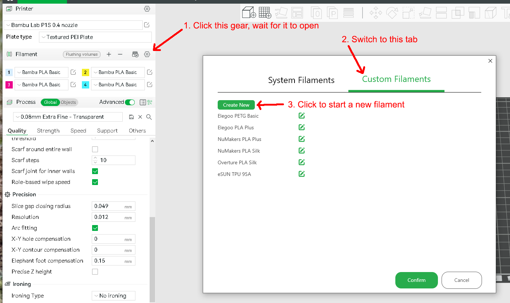

# How to Create Custom Filament Profiles

This process will first add a new filament type to both Bambu Studio and
your Handy app such that you can use the setting with your AMS. The
second step allows you to customize the filament profile.

- In Bambu Studio, start a new project with File > New Project.
- Locate the gear in the Filament section on the left side, click it.
  - Wait for it to load, it can take 10-15 seconds
- When the dialog opens, click the Custom Filaments tab.
- Click Create New to start a new entry.

- Select the Vendor from the list
  - or click Can't find vendor I want, and then type in the name of
    the vendor
- Select the Type of filament, like "PLA"
- Type in the Serial, something like Plus, Basic, Tranparent, Silk, etc.
- Select "Create based on Current Filament"
  - and then select the existing filament prest that you want to use as
    the base. You can customize this later, so start with "Generic PLA"
    or something appropriate.
- It will open a list of available nozzle sizes, select the sizes that
  you have/will use with this filament.
- Click Create to save the entry.
- back on the Custom Filaments window, click Confirm to save your changes.

## Adjust the Preset

- Back on your project page, select the new filament type that you created.
- Click the Edit Preset icon to the right of the filament entry.
- Edit any of the parameters as needed.
- Click the disk icon next to the preset name to Save.
- Change the preset name if you like, or just click OK to save it.

Credit: I learned this tip from this 
[Reddit post and comments](https://www.reddit.com/r/BambuLab/comments/16j5189/filament_profiles_importing_both_filament_and/)

