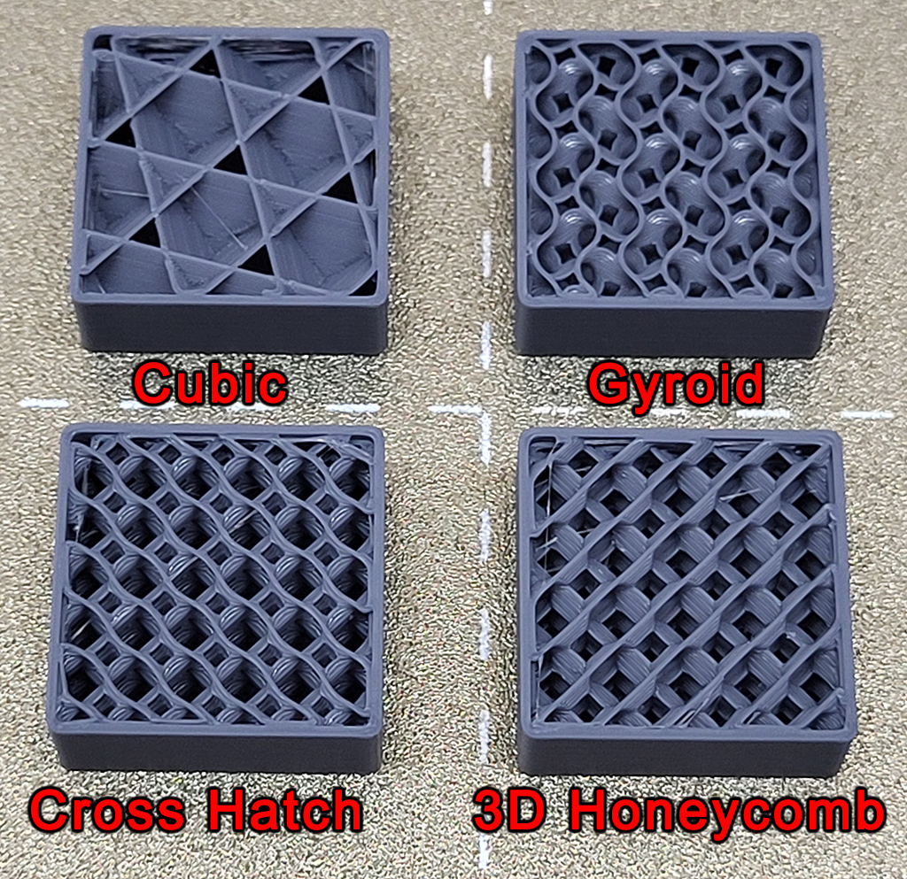

# Infill Settings

Did a quick test of some infill alternatives to the default Grid. For
each test, I made a 25 x 25 x 10cm rounded rectangle. Set the top
layers to 0. Set the infill to the test pattern and used 15% infill for
all of them.

| Infill Pattern | Time | Material | Notes |
| -------------- | ---- | -------- | ----- |
| Grid | 4:46s | 2.46g | Default, overlaps can cause scraping/collisions |
| Triangles | 4:46s | 2.52g | Fast, but more overlaps means more scraping |
| Cubic | 4:45s | 2.45g | Fast, fewer overlaps, has wide gaps on some layers |
| Gyroid | 4:59s | 2.47g | Slightly slower but no overlaps |
| Cross Hatch | 5:04s | 2.51g | Even slower, no overlaps, nice small features |
| 3D Honeycomb | 5:11s | 2.36g | Slowest, least dense, similar to gyroid |

I've been defaulting to Cubic over Gyroid for the slight speed increase.
I can now see that if I need surface support I would want a pattern with
more even gaps like Gyroid or Cross Hatch.

Additional source: 
[Rethink how you use 3D printer infill!](https://www.youtube.com/watch?v=nV3GbN6hLjg) -
youtube video by Made with Layers

I watched this video for the original advice that had me using
Cubic instead of Grid. He goes into a lot of detail.

