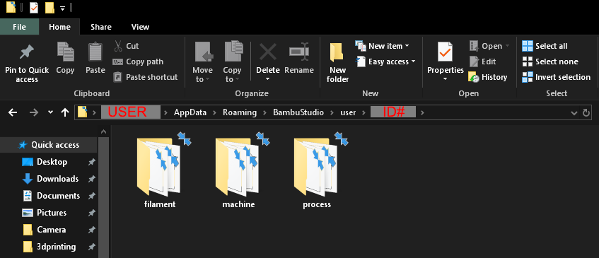
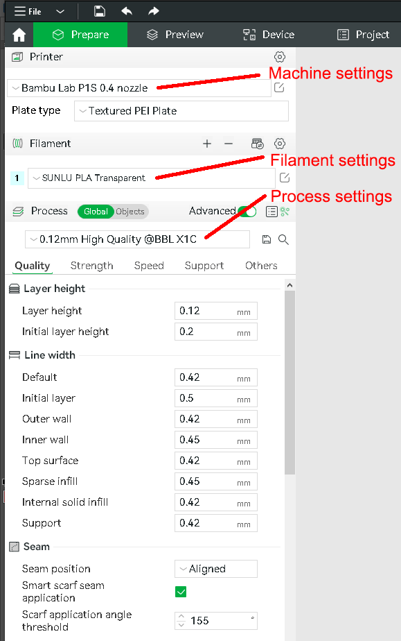

# Locating and Sharing Saved Printer/Filament Profiles

This applies to a Windows install of Bambu Studio.

- Open File Explorer in windows
- In the location bar, enter:
  `%USERPROFILE%\AppData\Roaming\BambuStudio\user`
  and hit return. It should open that folder.
  - If not, then you need to locate your user directory,
    usually something like `C:\Users\YOURUSERNAME`.
    Then navigate into the AppData, Roaming, BambuStudio, 
    and user folder.
- You should see a folder with your Bambu User ID number 
  for the name. Open that folder.
- Here you should see three folders:
  - filament
  - machine
  - process

- __Machine__ profiles - contain settings for your printer, usually
  customized per nozzle type.
- __Filament__ profiles - contain settings for each type of filament
  that you might use.
- __Process__ profiles - contain printing settings: Quality, Strength,
  Speed, Support, and Others.

Each folder contains two files for each setting that it has saved.
For example, in my filament folder, I have:
- `Overture PLA Silk.json`
  - This is a JSON format text file with all of the settings. If you are
    familiar with JSON, you could edit the file directly to change
    settings. You could also break the profile, so be careful and/or
    save backups.
- `Overture PLA Silk.info`
  - This is another text file with info used by Bambu Studio. I do not
    know how it is used or created. I see my user ID number in these, so
    I do not think they should be shared.

## Sharing / Importing Profiles

JSON files can be shared between users. I have placed copies of my
custom profiles in this repository.

To use one of them:

- Navigate to this [profiles/bambu](../profiles/bambu) directory.
- Open the folder for the profile you are looking for, like `filament`.
- Click on the name of the JSON file you want.
  - GitHub should show you the JSON text in that file.
- At the top right of the code block, there is a "Download raw file"
  icon. Click that to save the JSON file to your computer.
- Open Bambu Studio.
- Go to File > Import > Import Configs...
- Locate and select the JSON file that you downloaded.
- It should confirm that the configuration file was loaded.
- Try to load the profile using the pulldown for the same section.
  e.g. If you loaded a filament JSON, try to select that entry
  in the filament preset menu.

## Additional Profile Sources

* [Bambu Studio Source Repo](https://github.com/bambulab/BambuStudio/tree/master/resources/profiles/BBL)

* [Elegoo PLA+ Calibrated Profile](https://makerworld.com/en/models/71200)
  * [my filament profile](../profiles/bambu/filament/Elegoo%20PLA%20Plus.json)
  * [my process profile](../profiles/bambu/process/0.20mm%20Standard%20-%20Elegoo%20PLA%2B.json)

* [eSUN Filament Profiles](https://www.esun3d.com/zldownload_catalog/3d-printing-settings/)
  * download the rar file from the link for 
    "eSUN Filament Printing Parameters for Bambu Lab & Creality"

* [Perfect TPU 95A](https://makerworld.com/en/models/661830#profileId-589025)
  * [my filament profile](../profiles/bambu/filament/Perfect%20TPU%2095A.json)
  * [my process profile](../profiles/bambu/process/0.20mm%20Perfect%20TPU%2095A.json)

