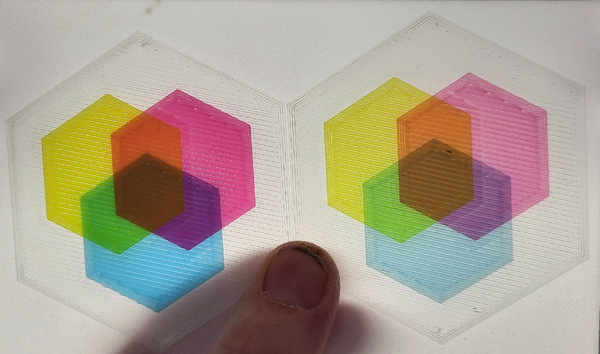

# Transparent PLA

I have a spool of Sunlu Transparent PLA. I experimented with getting
thin prints to be as smooth and clear as possible. This forum post by
user @konchog provided most of the information that I use:
- [Tranparently curious about ironing Update 2](https://forum.bambulab.com/t/transparently-curious-about-ironing/8930/8)

## Profile creation notes

- set filament to Generic PLA
- used and set PEI Smooth Plate

- 0.08 Extra Fine profile
  - First layer 0.08
  - Line Widths - ALL = 0.6 mm
  - Wall Loops 4
  - Top = Aligned Rectilinear
  - Top shell = 1, 0.08 thick
  - Bottom = same as Top
  - 100% infill, Aligned Rectilinear
  - Advanced infill/wall overlap = 60%
  - Other layer speeds
    - Sparse infill = 100 mm/s
    - Int solid infill = 100
    - Top surf = 100
  - Saved as [0.08mm Extra Fine - Transparent.json](../profiles/bambu/process/0.08mm%20Extra%20Fine%20-%20Transparent.json)

## Examples

Filament sample cards printed on PEI Smooth plate. Top one is
default 0.08 settings. Bottom one is using the profile tuned for
Transparent PLA.

Transparent PLA hexagons with one layer (right side) and two layers
(left side) of colored filament embedded in the transparent layers to
test color mixing. The colors are Bambu Basic Cyan, Magenta, and Yellow.

